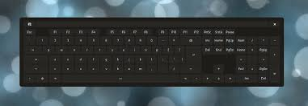

# OSK IoT Core

[](https://github.com/unklstewy/osk-iotcore/actions/workflows/ci.yml)
[](https://goreportcard.com/report/github.com/iotcore/osk-iotcore)
[](https://codecov.io/gh/unklstewy/osk-iotcore)
[](https://opensource.org/licenses/MIT)
[](https://pkg.go.dev/github.com/iotcore/osk-iotcore)

An on-screen keyboard written in GoLang with support for Wayland and X11.

## Overview

OSK IoT Core provides an efficient and customizable on-screen keyboard tailored for Linux environments, supporting both Wayland and X11 display servers. Developed in GoLang, it offers smooth integration with modern desktop environments.

## Features

- **Customizable Layouts**: Easily design and use custom keyboard layouts.
- **Wayland and X11 Support**: Seamless operation across the most common Linux display servers.
- **Efficiency**: Designed for minimal resource consumption and high performance.
- **Open Source**: Contributions are welcome to improve and expand functionality.

## Architecture

The keyboard utilizes Go's concurrency features to handle input efficiently, supporting distinct modules for Wayland and X11 environments.

## Getting Started

### Prerequisites

- Go 1.22+ (for development)
- CGO-enabled Go toolchain
- GCC compiler
- pkg-config

#### System Dependencies

**Wayland Core Libraries:**
- `wayland-client` - Core Wayland client library
- `wayland-server` - Wayland server library
- `wayland-protocols` - Wayland protocol definitions

**wlroots Ecosystem:**
- `wlroots` - Wayland compositor library
- `pixman-1` - Pixel manipulation library
- `libdrm` - Direct Rendering Manager
- `xkbcommon` - XKB common library for keyboard handling
- `libinput` - Input device management

**Rendering Dependencies:**
- `gl` or `opengl` - OpenGL library
- `egl` - EGL library for OpenGL ES
- `glesv2` - OpenGL ES v2 library

**System Integration:**
- `libudev` - Device management library
- `libsystemd` - systemd integration (optional)

#### Package Installation

**Ubuntu/Debian:**
```bash
sudo apt-get install build-essential pkg-config \
    libwayland-dev wayland-protocols \
    libwlroots-dev libpixman-1-dev libdrm-dev \
    libxkbcommon-dev libinput-dev \
    libgl1-mesa-dev libegl1-mesa-dev libgles2-mesa-dev \
    libudev-dev libsystemd-dev
```

**Fedora/RHEL:**
```bash
sudo dnf install gcc pkg-config \
    wayland-devel wayland-protocols-devel \
    wlroots-devel pixman-devel libdrm-devel \
    libxkbcommon-devel libinput-devel \
    mesa-libGL-devel mesa-libEGL-devel mesa-libGLES-devel \
    systemd-devel libudev-devel
```

**Arch Linux:**
```bash
sudo pacman -S base-devel pkg-config \
    wayland wayland-protocols \
    wlroots pixman libdrm libxkbcommon libinput \
    mesa systemd
```

### Installation

```bash
# Clone the repository
git clone https://github.com/unklstewy/osk-iotcore.git
cd osk-iotcore

# Check system dependencies
./scripts/check_deps.sh

# Install Go dependencies
go mod download

# Build the project
go build -o osk-iotcore

# Run the on-screen keyboard
./osk-iotcore
```

### Development Testing

To verify your development environment:

```bash
# Run the Wayland proof of concept
go run ./cmd/oskway --wayland-poc

# Run component tests
go run ./cmd/oskway --test

# Test layout switching
go run ./cmd/oskway --layout-test

# Show all available options
go run ./cmd/oskway --help
```

## Documentation

Detailed documentation is available in the `docs/` directory:

- [API Documentation](docs/api.md)
- [Device Integration Guide](docs/device-integration.md)
- [Deployment Guide](docs/deployment.md)
- [Configuration Reference](docs/configuration.md)

## Contributing

We welcome contributions! Please read our [Contributing Guide](CONTRIBUTING.md) for details on our code of conduct and the process for submitting pull requests.

### Development Workflow

1. Fork the repository
2. Create a feature branch (`git checkout -b feature/amazing-feature`)
3. Commit your changes (`git commit -m 'Add some amazing feature'`)
4. Push to the branch (`git push origin feature/amazing-feature`)
5. Open a Pull Request

## License

This project is licensed under the MIT License - see the [LICENSE](LICENSE) file for details.

## Support

- **Documentation**: [docs/](docs/)
- **Issues**: [GitHub Issues](https://github.com/unklstewy/osk-iotcore/issues)
- **Discussions**: [GitHub Discussions](https://github.com/unklstewy/osk-iotcore/discussions)

## Themes & Layouts

### Available Themes

The OSK IoT Core supports multiple visual themes that can be selected via configuration files. Below is a list of available themes with miniature thumbnails:

| Theme      | Preview | Description |
|------------|---------|-------------|
| Default    |  | Standard light theme with good contrast |
| Glass      |  | Modern glass theme with translucent effects |
| Dark       |  | Dark theme optimized for low-light environments |
| Vibrant    |  | Bold vibrant theme with saturated colors |
| Minimalist | - | Clean minimalist theme with monochromatic design |
| Pastel     | - | Soft pastel theme with muted colors |

### Available Layouts

Here is a table listing the new layout file names:

| Layout Name | File Name        | Description |
|-------------|------------------|--------------|
| Style One   | style_one.json   | Mobile QWERTY keyboard layout with standard key arrangement |
| Style Two   | style_two.json   | Mobile QWERTY keyboard layout with additional symbols and function keys |
| Style Three | style_three.json | Compact mobile QWERTY keyboard layout with emoji and special function keys |
| Style Four  | style_four.json  | Minimal mobile QWERTY keyboard layout with gesture support and streamlined design |

### Configuration

To apply a theme or layout, you can:

1. **Via Configuration Files**: Edit your configuration files to specify the desired theme and layout
2. **Programmatically**: Use the keyboard API to load themes and layouts:
   ```go
   kb, err := keyboard.New()
   if err != nil {
       log.Fatal(err)
   }
   
   // Load a specific theme
   err = kb.LoadTheme("glass")
   if err != nil {
       log.Fatal(err)
   }
   
   // Switch to a specific layout
   err = kb.SwitchLayout("style_one")
   if err != nil {
       log.Fatal(err)
   }
   ```

3. **Command-line Testing**: Use the provided test commands to preview layouts:
   ```bash
   # Test layout switching
   go run ./cmd/oskway --layout-test
   
   # Generate screenshots of all layouts
   go run ./cmd/oskway --screenshot
   ```

## Roadmap

- [ ] Complete Wayland protocol implementation
- [ ] Full X11 support with input method integration
- [ ] Theme and layout customization
- [ ] Multi-language support
- [ ] Configuration GUI
- [ ] Performance optimizations

## Acknowledgments

- Thanks to the Wayland and X11 communities for their excellent documentation
- Special thanks to the Go community for providing robust libraries for GUI development

---

**OSK IoT Core** - On-Screen Keyboard for Linux
