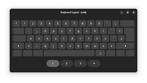

# Configuration Guide

## Overview

OSK IoT Core supports extensive configuration options for themes, layouts, and keyboard behavior. This guide covers all available configuration options and how to use them.

## Themes & Layouts

### Available Themes

The OSK IoT Core supports multiple visual themes that can be selected via configuration files. Below is a list of available themes with miniature thumbnails:

| Theme      | Preview | Description | Location |
|------------|---------|-------------|----------|
| Default    |  | Standard light theme with good contrast | `assets/themes/default.json` |
| Glass      |  | Modern glass theme with translucent effects | `assets/themes/glass.json` |
| Dark       |  | Dark theme optimized for low-light environments | `assets/themes/dark.json` |
| Vibrant    |  | Bold vibrant theme with saturated colors | `assets/themes/vibrant.json` |
| Minimalist | - | Clean minimalist theme with monochromatic design | `assets/themes/minimalist.json` |
| Pastel     | - | Soft pastel theme with muted colors | `assets/themes/pastel.json` |

### Available Layouts

Here is a table listing the new layout file names:

| Layout Name | File Name        | Description | Location |
|-------------|------------------|-------------|----------|
| Style One   | style_one.json   | Mobile QWERTY keyboard layout with standard key arrangement | `assets/layouts/style_one.json` |
| Style Two   | style_two.json   | Mobile QWERTY keyboard layout with additional symbols and function keys | `assets/layouts/style_two.json` |
| Style Three | style_three.json | Compact mobile QWERTY keyboard layout with emoji and special function keys | `assets/layouts/style_three.json` |
| Style Four  | style_four.json  | Minimal mobile QWERTY keyboard layout with gesture support and streamlined design | `assets/layouts/style_four.json` |

## Configuration Methods

### 1. Programmatic Configuration

You can configure themes and layouts programmatically using the keyboard API:

```go
package main

import (
    "log"
    "github.com/iotcore/osk-iotcore/pkg/keyboard"
)

func main() {
    // Initialize keyboard
    kb, err := keyboard.New()
    if err != nil {
        log.Fatal(err)
    }
    
    // Load a specific theme
    err = kb.LoadTheme("glass")
    if err != nil {
        log.Fatal(err)
    }
    
    // Switch to a specific layout
    err = kb.SwitchLayout("style_one")
    if err != nil {
        log.Fatal(err)
    }
    
    // List available layouts
    layouts, err := kb.ListAvailableLayouts()
    if err != nil {
        log.Fatal(err)
    }
    
    log.Printf("Available layouts: %v", layouts)
}
```

### 2. Command-line Testing

Use the provided test commands to preview layouts:

```bash
# Test layout switching
go run ./cmd/oskway --layout-test

# Generate screenshots of all layouts
go run ./cmd/oskway --screenshot

# Run component tests
go run ./cmd/oskway --test

# Show all available options
go run ./cmd/oskway --help
```

## Theme Configuration

### Theme Structure

Each theme is defined in a JSON file with the following structure:

```json
{
  "name": "theme_name",
  "description": "Theme description",
  "background_color": [0.2, 0.2, 0.2, 1.0],
  "key_color": [0.8, 0.8, 0.8, 1.0],
  "key_pressed_color": [0.6, 0.6, 0.6, 1.0],
  "key_hover_color": [0.7, 0.7, 0.7, 1.0],
  "text_color": [0.0, 0.0, 0.0, 1.0],
  "border_color": [0.5, 0.5, 0.5, 1.0],
  "font_size": 16,
  "border_radius": 4,
  "border_width": 1,
  "key_padding": 2,
  "shadow_enabled": true,
  "shadow_color": [0.0, 0.0, 0.0, 0.3],
  "shadow_offset": [2, 2],
  "shadow_blur": 4
}
```

### Color Format

Colors are specified as RGBA arrays with values between 0.0 and 1.0:
- `[R, G, B, A]` where A is the alpha (transparency) channel
- Example: `[1.0, 0.0, 0.0, 1.0]` = opaque red
- Example: `[0.0, 0.0, 0.0, 0.5]` = semi-transparent black

### Creating Custom Themes

1. Create a new JSON file in the `assets/themes/` directory
2. Follow the theme structure above
3. Set your desired colors and styling properties
4. Load the theme using `kb.LoadTheme("your_theme_name")`

## Layout Configuration

### Layout Structure

Each layout is defined in a JSON file with the following structure:

```json
{
  "name": "layout_name",
  "description": "Layout description",
  "width": 820,
  "height": 300,
  "keys": [
    {
      "id": "key_id",
      "label": "Key Label",
      "code": 16,
      "x": 20,
      "y": 20,
      "width": 70,
      "height": 60,
      "modifier": false
    }
  ]
}
```

### Key Properties

- `id`: Unique identifier for the key
- `label`: Display text on the key
- `code`: Linux key code (see `/usr/include/linux/input-event-codes.h`)
- `x`, `y`: Position coordinates
- `width`, `height`: Key dimensions
- `modifier`: Boolean indicating if this is a modifier key (Shift, Ctrl, etc.)

### Creating Custom Layouts

1. Create a new JSON file in the `assets/layouts/` directory
2. Define the layout dimensions and key positions
3. Set appropriate key codes for each key
4. Load the layout using `kb.SwitchLayout("your_layout_name")`

## Runtime Configuration

### Keyboard Callbacks

Register callbacks for key events:

```go
// Register a callback for a specific key
kb.RegisterCallback("a", func(key *keyboard.Key) {
    fmt.Printf("Key pressed: %s (label: %s)\n", key.ID, key.Label)
})

// Trigger the callback
kb.PressKey("a")
```

### Key State Management

```go
// Press a key
err := kb.PressKey("space")
if err != nil {
    log.Printf("Error pressing key: %v", err)
}

// Check key state
state := kb.GetKeyState("space")
switch state {
case keyboard.KeyStateReleased:
    fmt.Println("Key is released")
case keyboard.KeyStatePressed:
    fmt.Println("Key is pressed")
case keyboard.KeyStateRepeating:
    fmt.Println("Key is repeating")
}

// Release a key
err = kb.ReleaseKey("space")
if err != nil {
    log.Printf("Error releasing key: %v", err)
}
```

### Layout Switching

```go
// Get current layout name
currentLayout := kb.GetCurrentLayoutName()
fmt.Printf("Current layout: %s\n", currentLayout)

// Switch to a different layout
err := kb.SwitchLayout("style_two")
if err != nil {
    log.Printf("Error switching layout: %v", err)
}

// Refresh the current layout from disk
err = kb.RefreshLayout()
if err != nil {
    log.Printf("Error refreshing layout: %v", err)
}
```

## Advanced Configuration

### File Locations

The OSK IoT Core searches for configuration files in the following order:

1. `assets/themes/` and `assets/layouts/` (relative to executable)
2. `themes/` and `layouts/` (relative to executable)
3. `../assets/themes/` and `../assets/layouts/` (for development)

### Error Handling

Always check for errors when loading themes and layouts:

```go
err := kb.LoadTheme("nonexistent_theme")
if err != nil {
    log.Printf("Failed to load theme: %v", err)
    // Fall back to default theme
    kb.LoadTheme("default")
}
```

### Performance Considerations

- Theme and layout loading is performed synchronously
- Large layouts with many keys may impact performance
- Consider caching loaded themes and layouts for better performance
- Use the `--screenshot` command to generate thumbnails for preview

## Troubleshooting

### Common Issues

1. **Theme not loading**: Check that the JSON file exists and is valid
2. **Layout not displaying correctly**: Verify key coordinates fit within layout dimensions
3. **Key codes not working**: Ensure key codes match your system's input event codes
4. **File not found errors**: Check file paths and permissions

### Debug Commands

```bash
# Test all components
go run ./cmd/oskway --test

# Test layout switching specifically
go run ./cmd/oskway --layout-test

# Generate debug screenshots
go run ./cmd/oskway --screenshot
```

### Logging

Enable verbose logging for debugging:

```go
import "log"

// Enable debug logging
log.SetFlags(log.LstdFlags | log.Lshortfile)
```
